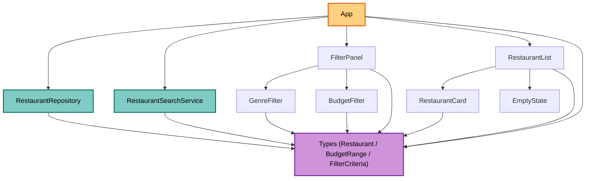
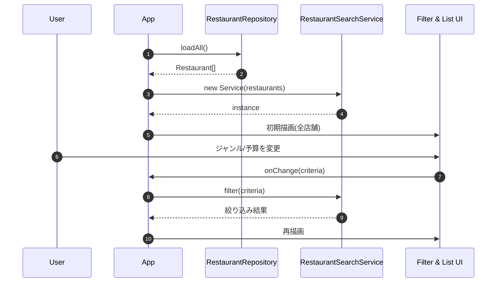

# Component Dependency — zagin-me-si-

**作成日**: 2026-05-27

---

## 依存方向

矢印は「A → B = A が B に依存する（A が B を import / 呼び出す）」を意味する。

---

## 依存マトリクス

|              | App | Repo | Svc | FP | GF | BF | RL | RC | ES | Types |
|--------------|:---:|:---:|:---:|:---:|:---:|:---:|:---:|:---:|:---:|:---:|
| App          |  -  |  ✓  |  ✓  |  ✓  |  -  |  -  |  ✓  |  -  |  -  |  ✓   |
| Repo         |  -  |  -  |  -  |  -  |  -  |  -  |  -  |  -  |  -  |  ✓   |
| Svc          |  -  |  -  |  -  |  -  |  -  |  -  |  -  |  -  |  -  |  ✓   |
| FilterPanel  |  -  |  -  |  -  |  -  |  ✓  |  ✓  |  -  |  -  |  -  |  ✓   |
| GenreFilter  |  -  |  -  |  -  |  -  |  -  |  -  |  -  |  -  |  -  |  ✓   |
| BudgetFilter |  -  |  -  |  -  |  -  |  -  |  -  |  -  |  -  |  -  |  ✓   |
| RestaurantList |  -  |  -  |  -  |  -  |  -  |  -  |  -  |  ✓  |  ✓  |  ✓   |
| RestaurantCard |  -  |  -  |  -  |  -  |  -  |  -  |  -  |  -  |  -  |  ✓   |
| EmptyState   |  -  |  -  |  -  |  -  |  -  |  -  |  -  |  -  |  -  |  -   |

- 依存は **一方向**（DAG）
- 循環依存は存在しない
- 子コンポーネント（GF/BF/RC/ES）は他のドメインコンポーネントを知らない（再利用性が高い）

---

## 通信パターン

| ソース → デスティネーション | 方法 | データ |
|------------------|------|--------|
| App → Repo | コンストラクタ + `await loadAll()` | URL |
| App → Svc | コンストラクタで配列を渡す | `Restaurant[]` |
| App → FilterPanel | props 経由（criteria, availableGenres, onChange） | 値 + コールバック |
| FilterPanel → GenreFilter | props 経由 | selected, available, onChange |
| FilterPanel → BudgetFilter | props 経由 | selected, onChange |
| App → RestaurantList | props 経由 | `Restaurant[]` |
| RestaurantList → RestaurantCard | 各要素を map で渡す | `Restaurant` |
| RestaurantList → EmptyState | 空判定で条件レンダリング | - |

- UI 層は完全に **単方向データフロー**（React の標準パターン）
- グローバル状態管理ライブラリは使わない（useState で十分、Q3=A）

---

## データフロー図

