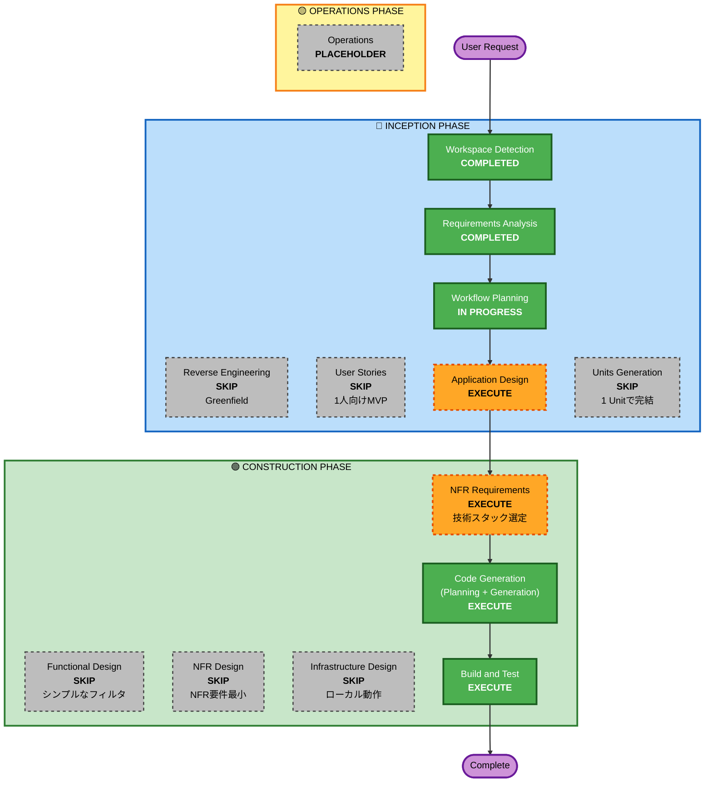

# Execution Plan — zagin-me-si-

**作成日**: 2026-05-27
**プロジェクトタイプ**: Greenfield

---

## Detailed Analysis Summary

### Change Impact Assessment
- **User-facing changes**: Yes — 銀座のランチ検索Webアプリのフロントエンド全体が新規
- **Structural changes**: Yes — プロジェクトの初期構造を新規構築
- **Data model changes**: Yes — 店舗エンティティ・絞り込みパラメータの定義が新規
- **API changes**: 該当なし — 認証なし、外部API利用なし。クライアントサイドで完結も可
- **NFR impact**: 低 — パフォーマンス・スケールは限定的（ローカル/個人利用想定）

### Risk Assessment
- **Risk Level**: Low
- **Rollback Complexity**: Easy（コミット単位で巻き戻し可）
- **Testing Complexity**: Simple（ユニットテストで十分）

---

## Workflow Visualization

---

## Phases to Execute

### 🔵 INCEPTION PHASE
- [x] Workspace Detection — **COMPLETED**
- [x] Reverse Engineering — **SKIPPED**（Greenfield のため）
- [x] Requirements Analysis — **COMPLETED**
- [x] User Stories — **SKIPPED**（1人向けMVPでペルソナ複数不要）
- [x] Workflow Planning — **IN PROGRESS**
- [ ] Application Design — **EXECUTE**
  - **Rationale**: コンポーネント構成（フロント / データ層 / フィルタロジック）を明確にする必要あり
- [ ] Units Generation — **SKIPPED**
  - **Rationale**: 1 Unit（zagin-web）で完結するため分解不要

### 🟢 CONSTRUCTION PHASE
- [ ] Functional Design — **SKIPPED**
  - **Rationale**: フィルタ処理は単純な配列フィルタで、複雑な業務ロジックが無い
- [ ] NFR Requirements — **EXECUTE**
  - **Rationale**: フレームワーク（Next.js / Vite+React / Express など）の選定を要する
- [ ] NFR Design — **SKIPPED**
  - **Rationale**: 認証・スケール・監視等の NFR 要件が無い
- [ ] Infrastructure Design — **SKIPPED**
  - **Rationale**: ローカル開発のみ。クラウド展開はスコープ外
- [ ] Code Generation — **EXECUTE**（ALWAYS）
  - **Rationale**: 実装プラン作成とコード生成のため必須
- [ ] Build and Test — **EXECUTE**（ALWAYS）
  - **Rationale**: ビルドとテスト実行のため必須

### 🟡 OPERATIONS PHASE
- [ ] Operations — **PLACEHOLDER**

---

## Estimated Timeline
- **Total Stages to Execute**: 4（Application Design / NFR Requirements / Code Generation / Build and Test）
- **Estimated Duration**: 短時間（数十分〜1時間程度を想定。MVPで小規模）

---

## Success Criteria
- **Primary Goal**: 銀座のランチをジャンル・予算で絞り込めるWebアプリがローカルで動作する
- **Key Deliverables**:
  - 動作する TypeScript/Node.js ベースのWebアプリ
  - サンプル店舗データ（JSON）
  - ユニットテスト（フィルタロジック中心）
  - README に起動方法を記載
- **Quality Gates**:
  - TypeScript の型チェック通過
  - ユニットテスト全て pass
  - dev サーバー起動 & ブラウザでフィルタ動作確認
